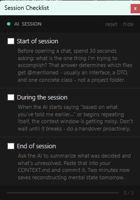

# AI Session Checklist ✅

A tiny always-on-top Windows desktop widget that keeps your AI coding session habits honest.



---

## The Problem

Long AI coding sessions snowball. Every new message re-sends the entire chat history, your context window fills up, and the AI starts hedging — *"based on what you've told me earlier..."* — until it forgets what you were even building. Most developers know the best practices. They just don't follow them in the moment.

This widget sits on your desktop and quietly judges you until you do.

---

## What It Does

Three checkboxes. Always visible. Always on top.

| Checkpoint | Reminder |
|---|---|
| **Start of session** | Before opening a chat, spend 30 seconds deciding what you're trying to accomplish. That answer determines which files get @mentioned — usually an interface, a DTO, and one concrete class — not a whole project folder. |
| **During the session** | When the AI starts saying *"based on what you've told me earlier..."* or begins repeating itself, the context window is getting noisy. Don't wait until it breaks — do a handover proactively. |
| **End of session** | Ask the AI to summarize what was decided and what's unresolved. Paste that into your CONTEXT.md and commit it. Two minutes now saves reconstructing mental state tomorrow. |

Progress bar at the bottom fills as you tick off items. Collapses to a single header strip when you need it out of the way. Resets for the next session with one click.

---

## Requirements

- Windows
- Windows PowerShell 5.1 (built into every modern Windows install — you already have it)

That's it. No install. No dependencies. No NuGet. No npm. Just a `.ps1` file.

---

## Usage

**Run once:**
```powershell
powershell.exe -File "SessionChecklist.ps1"
```

**Run without a terminal window** (recommended):
```powershell
powershell.exe -WindowStyle Hidden -File "SessionChecklist.ps1"
```

**Run on startup automatically:**

1. Press `Win+R`, type `shell:startup`, hit Enter
2. Right-click → New → Shortcut
3. Set the location to:
   ```
   powershell.exe -WindowStyle Hidden -File "C:\path\to\SessionChecklist.ps1"
   ```
4. Done — it'll launch silently with Windows every time

**If Windows blocks it** (common when synced via Google Drive or downloaded from the web):
```powershell
Unblock-File -Path "C:\path\to\SessionChecklist.ps1"
```

> **Note:** If you're running from PowerShell 7 (`pwsh.exe`), invoke it via `powershell.exe` explicitly — WPF requires Windows PowerShell 5.1.

---

## Why PowerShell + WPF?

Because the best tool is the one that's already on your machine. No runtime to install, no Electron eating your RAM, no auto-updater phoning home. It's ~200 lines of script that does exactly one thing and then gets out of your way.

---

## The Philosophy Behind It

These three checkboxes map to a real context management workflow for AI-assisted development:

- **Selective targeting** — @mention specific files, not whole folders
- **Proactive handovers** — reset the session before it degrades, not after
- **CONTEXT.md as save state** — treat your context file like a commit; update it every session

If you want to go deeper on any of these, the [Anthropic prompting docs](https://docs.claude.com/en/docs/build-with-claude/prompt-engineering/overview) are a solid starting point.

---

## License

MIT — do whatever you want with it.
